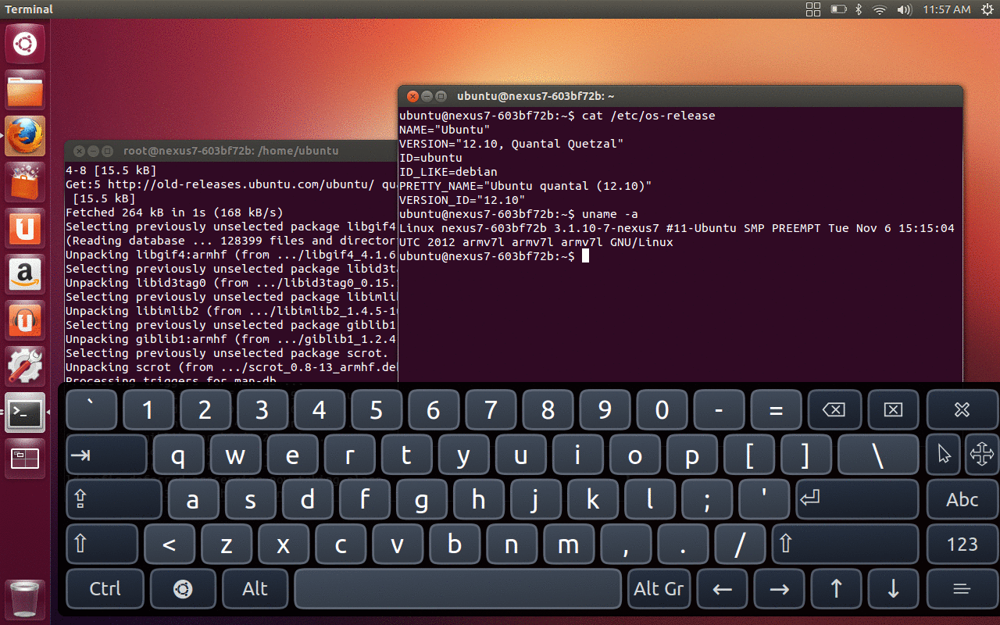

## Ubuntu for Nexus 7 (tilapia)

A modification of Ubuntu 12.10 installation for Nexus 7 (the original version can be found here: https://wiki.ubuntu.com/Nexus7/Installation).

Main changes are:

* Recovery kernel with special initramfs. Used to reinstall kernel and format /data partition if needed.
* Installation rootfs located on /system partition. On first boot it will be unpacked to /data partition.
* Fixed repository URLs.



### Installing

1. Unlock device:
```
fastboot oem unlock
```

2. Erase all partitions:
```
fastboot erase boot
fastboot erase recovery
fastboot erase system
fastboot erase userdata
fastboot erase cache
```

3. Download and flash system partition:
```
wget https://github.com/xeffyr/nexus7-tilapia-ubuntu/releases/download/rel_0/system.img
fastboot flash system system.img
```

4. Download and flash recovery partition:
```
wget https://github.com/xeffyr/nexus7-tilapia-ubuntu/releases/download/rel_0/recovery.img
fastboot flash recovery recovery.img
```

5. Flash recovery to **boot** (!) partiton.
```
fastboot flash boot recovery.img
```

6. Done, reboot device now:
```
fastboot reboot
```

However, before reboot you may also want to lock bootloader:
```
fastboot oem lock
fastboot reboot
```

### Uninstalling

1. Unlock bootloader (if locked):
```
fastboot oem unlock
```

2. Erase partitions:
```
fastboot erase boot
fastboot erase recovery
fastboot erase system
fastboot erase userdata
fastboot erase cache
```

3. Install ClockworkMod recovery:
```
wget https://github.com/xeffyr/nexus7-tilapia-ubuntu/releases/download/rel_0/recovery-clockwork-touch-6.0.4.3-tilapia.img
fastboot flash recovery recovery-clockwork-touch-6.0.4.3-tilapia.img
```

4. Format partitions to prevent recovery errors:
```
fastboot format system
fastboot format userdata
fastboot format cache
```

5. Now you can boot to recovery and install ROMs.

## Disclamier

*I'm not responsible about broken devices by installing stuff available here. If you are installing Ubuntu using steps listed here, you are doing this on your own risk.*
